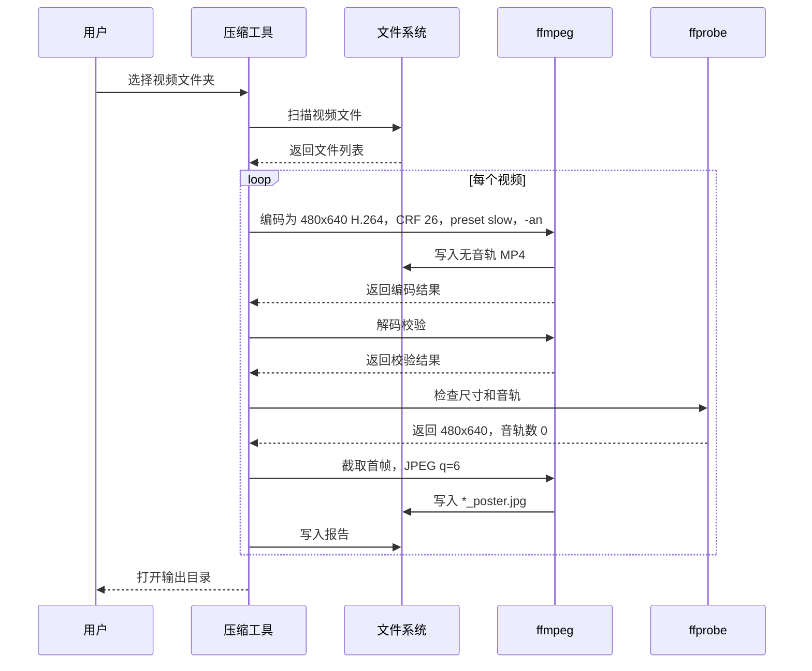

# 引导页视频压缩工具使用说明

## 用途

这个工具用于把引导页、教程页、轻量展示视频统一处理为 App 内可用的轻量资源。

固定输出规则：

- 视频尺寸：`480x640`
- 视频格式：`.mp4`
- 视频编码：`H.264 / libx264`
- 质量参数：`CRF 26`
- 编码参数：`preset slow`
- 音轨：移除
- 海报：自动生成首帧 `*_poster.jpg`
- 源文件：不覆盖、不修改
- 输出目录：输入目录下的 `output/video_compressed_480x640_no_audio_<时间戳>/`

## 给非技术同事的用法

推荐使用 macOS App：

1. 打开 `dist/引导页视频压缩工具.app`。
2. 在弹出的窗口中选择包含视频的文件夹。
3. 等待处理完成。
4. 工具会自动打开输出目录。

也可以使用双击脚本：

1. 打开项目里的 `tools/压缩引导页视频.command`。
2. 点击“选择视频文件夹”。
3. 选择包含视频的文件夹。
4. 点击“开始压缩”。
5. 等待完成。
6. 工具会自动打开输出目录。

输出目录里会包含：

- `videos/`：压缩后的视频和海报图
- `final_report.tsv`：机器可读报告
- `summary.md`：人可读摘要
- `FFMPEG_PROCESS.md`：完整 ffmpeg 参数和处理流程

说明：如果当前 Python 没有 Tkinter 图形界面模块，工具会自动改用 macOS 原生文件夹选择弹窗，不需要用户安装 Tkinter。

## 构建 macOS App

在项目根目录运行：

```bash
tools/build_video_compressor_app.sh
```

生成结果：

```text
dist/引导页视频压缩工具.app
```

这个 App 会调用同一份压缩逻辑。双击后会弹出 macOS 原生文件夹选择窗口，不依赖 Tkinter。

## 给工程同事的命令行用法

```bash
python3 tools/compress_onboarding_videos.py "/path/to/video-folder" --open
```

不打开输出目录：

```bash
python3 tools/compress_onboarding_videos.py "/path/to/video-folder"
```

启动图形界面：

```bash
python3 tools/compress_onboarding_videos.py --gui
```

## 依赖

工具需要 `ffmpeg` 和 `ffprobe`。

工程环境可用：

```bash
brew install ffmpeg
```

更适合团队分发的方式是把 `ffmpeg` 和 `ffprobe` 放到：

```text
tools/bin/ffmpeg
tools/bin/ffprobe
```

这样非技术同事不需要手动安装 Homebrew 或 ffmpeg。

如果要把依赖打进 `.app`，放到：

```text
dist/引导页视频压缩工具.app/Contents/Resources/bin/ffmpeg
dist/引导页视频压缩工具.app/Contents/Resources/bin/ffprobe
```

脚本会优先查找这些内置路径，然后再查找 Homebrew 常见路径。

## 完整 ffmpeg 参数

视频处理：

```bash
ffmpeg \
  -nostdin \
  -hide_banner \
  -loglevel error \
  -y \
  -i "input.mp4" \
  -map 0:v:0 \
  -vf "scale=480:640:force_original_aspect_ratio=increase,crop=480:640" \
  -c:v libx264 \
  -preset slow \
  -crf 26 \
  -pix_fmt yuv420p \
  -an \
  -movflags +faststart \
  -map_metadata -1 \
  -map_chapters -1 \
  "output.mp4"
```

海报图：

```bash
ffmpeg \
  -nostdin \
  -hide_banner \
  -loglevel error \
  -y \
  -i "output.mp4" \
  -frames:v 1 \
  -q:v 6 \
  "output_poster.jpg"
```

解码校验：

```bash
ffmpeg \
  -nostdin \
  -v error \
  -i "output.mp4" \
  -f null \
  -
```

## 处理流程


## 时序图



## 验收标准

每次处理完成后，工具会生成报告。验收时确认：

- 每个输出视频尺寸都是 `480x640`
- 每个输出视频音轨数都是 `0`
- 每个输出视频都有同前缀 `*_poster.jpg`
- `final_report.tsv` 存在
- `summary.md` 存在
- 源目录下的原始视频没有被覆盖
